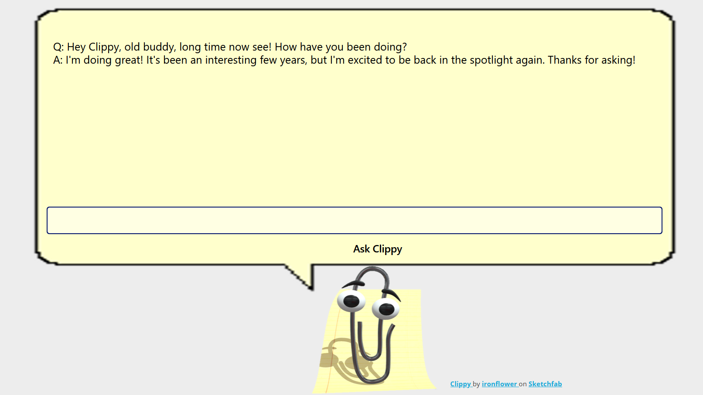
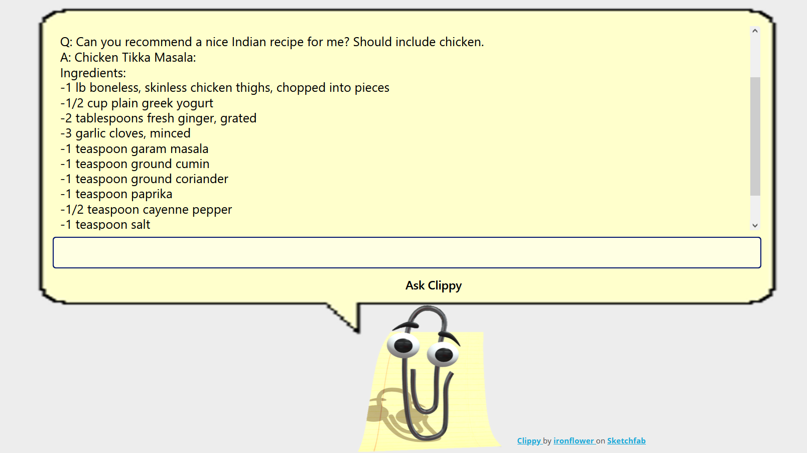
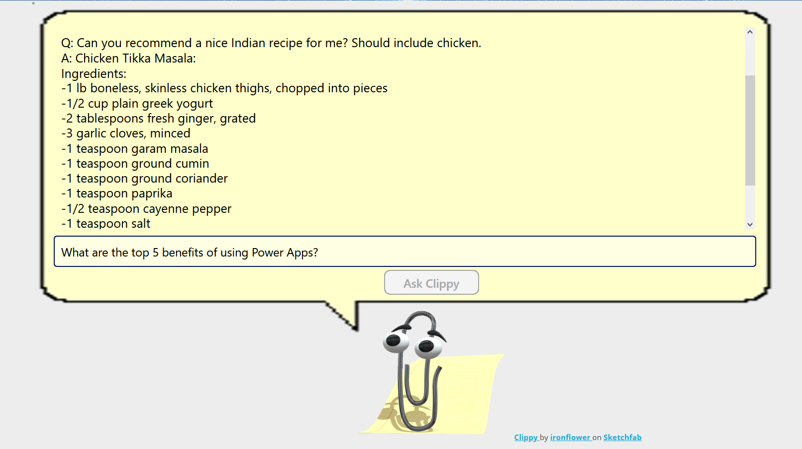

# Clippy Chat - A smarter Clippy in Power Apps!

A simple solution that shows how the OpenAI Connector could be used. Featuring history's most popular virtual assistant, Clippy!

[Download it here: ClippyChat_1_0_0_1.zip](ClippyChat_1_0_0_1.zip)

Start talking to Clippy

Clippy has some good taste

Clippy is thinking about an appropriate answer

More details:
[Details on the OpenAI connector](https://learn.microsoft.com/en-us/connectors/openaiip/)
[Independent Publisher Connector - OpenAI connector on using AI for content creation and interactions - In this 14-minute developer-focused demo, Robin Rosengrün shows how through his connector](https://www.youtube.com/watch?v=EfhqK21wYX8)
